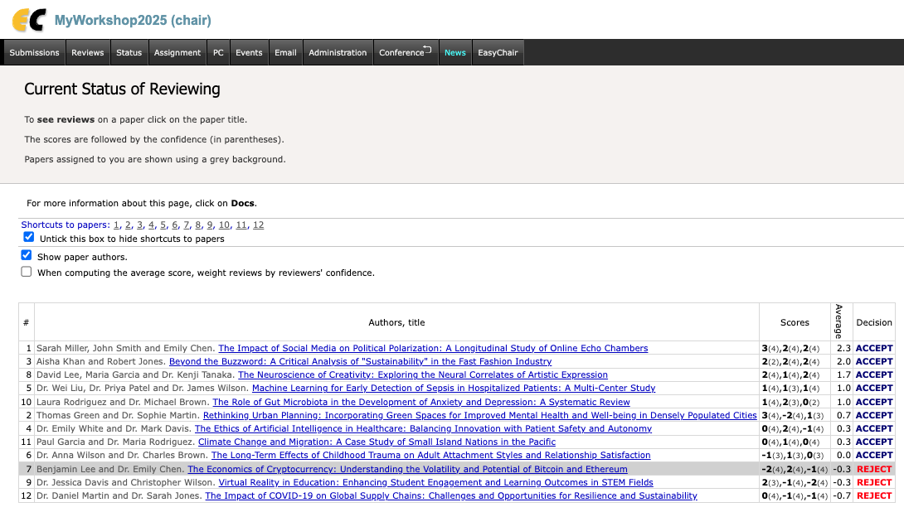

# EasyChair to CEUR.WS Table of Contents
Bookmarklet to convert EasyChair accepted papers to CEUR.WS Table of Contents.

Given a list of accepted papers available on EasyChair, this bookmarklet will generate the HTML Table of Contents to go into CEUR's [index.html](https://ceur-ws.org/Vol-XXX/index.html).

Specifically, it generates all the necessary tags, such as:

```html
<li id="paper1"><a href="paper1.pdf">
<span class="CEURTITLE">Fanciful title</span></a>
<span class="CEURPAGES">XX-YY</span> 
<br>
<span class="CEURAUTHOR">Author 1</span>, 
<span class="CEURAUTHOR">Author 2</span>, 
<span class="CEURAUTHOR">Author 3</span>
</li>
```


# How to install
Please [read here](https://htmlpreview.github.io/?https://raw.githubusercontent.com/angelosalatino/easychair-to-ceurws-toc/refs/heads/main/index.html)

# How it works
Given your conference/workshop instance, head to "Status" tab, where you should have your accepted/rejected papers. As showed below.




Once in there, you can click the bookmarklet, and it will fill the html page with HTML toc, ready to be pasted in CEUR's index.html.


Enjoy ;)
